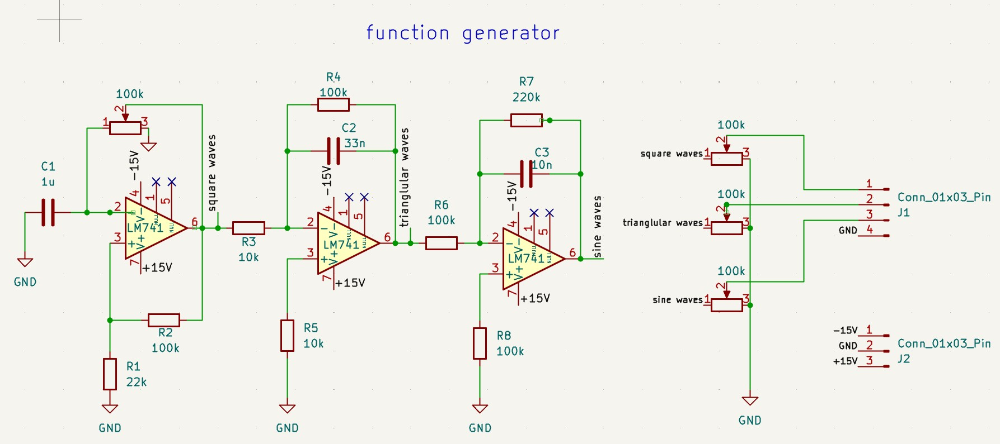
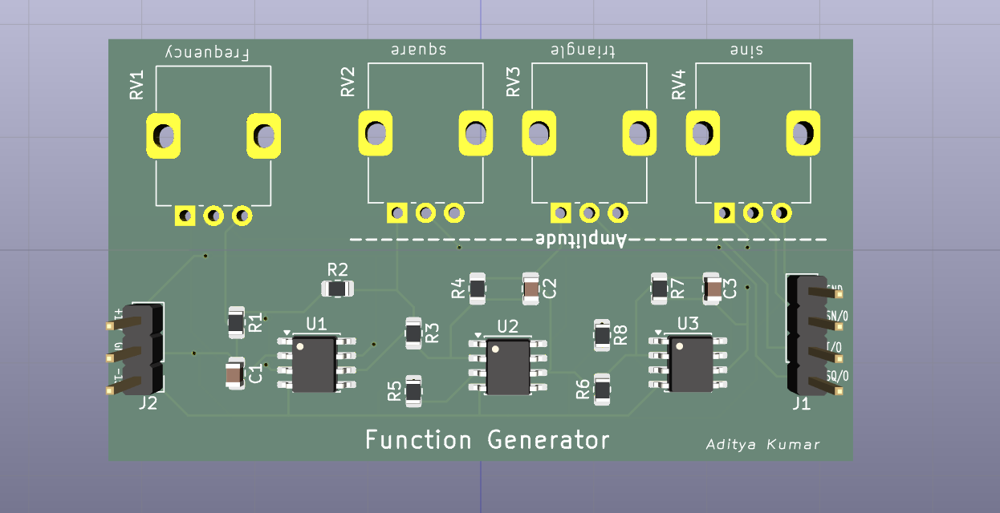
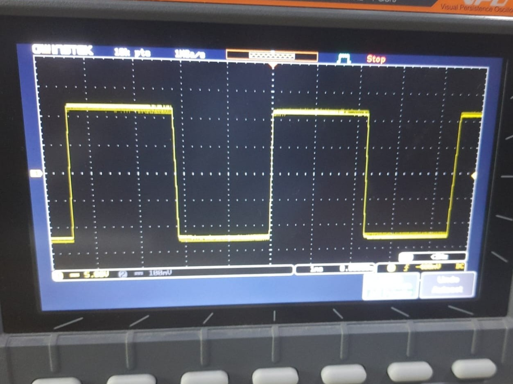
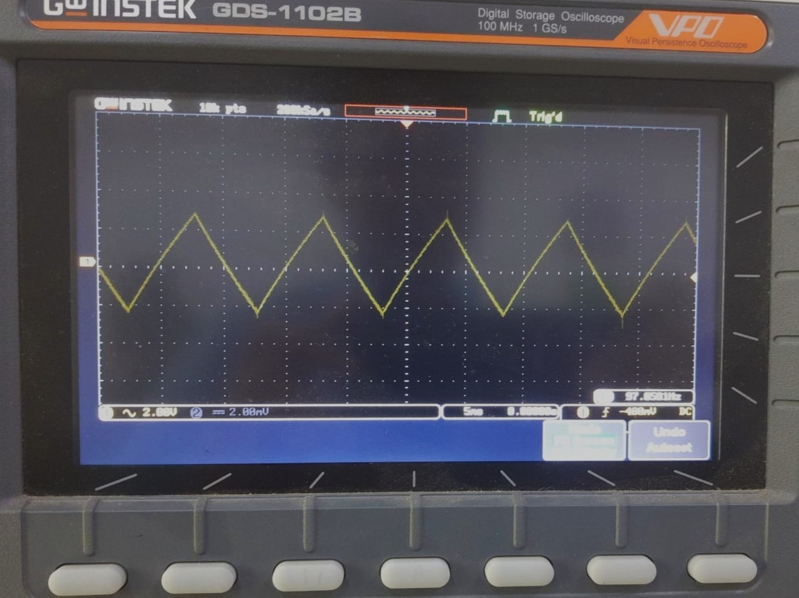

# Function Generator Using LM741 Operational Amplifiers

<p align="center">
  
</p>

<p align="center">
  
  
  
  
</p>

---

# 📖 Overview

A **Function Generator** is one of the most essential laboratory instruments used in electronics for testing, debugging, and analyzing analog and digital circuits. This project demonstrates the design and implementation of a **low-cost analog function generator** using **LM741 Operational Amplifiers** capable of producing three fundamental waveforms:

* 🟩 Square Wave
* 🔺 Triangle Wave
* 🌊 Sine Wave

The circuit is designed using three op-amp stages:

* **Schmitt Trigger (Comparator)** → Generates Square Wave
* **Active Integrator** → Converts Square Wave into Triangle Wave
* **Active Sine Wave Shaper (Low Pass Filter)** → Converts Triangle Wave into Sine Wave

The frequency of the generated signals can be adjusted using a **100KΩ potentiometer**, making the circuit suitable for laboratory demonstrations, educational purposes, and basic signal testing.

---

# ✨ Features

* Generates **Square, Triangle, and Sine** waves simultaneously
* Adjustable output frequency
* Simple analog design
* Low-cost implementation
* Easy to understand
* Suitable for beginners in Analog Electronics
* Ideal laboratory experiment
* PCB friendly design
* Uses easily available components

---

# 🎯 Objectives

* Design a low-cost analog function generator.
* Generate multiple waveforms using operational amplifiers.
* Study Schmitt Trigger operation.
* Learn integrator circuits.
* Understand sine wave shaping techniques.
* Gain practical PCB design experience.
* Analyze waveform generation using oscilloscopes.

---

# 🧠 Working Principle

The circuit consists of **three stages**.

## Stage 1 — Square Wave Generator

The first LM741 operates as a **Schmitt Trigger Oscillator**.

The capacitor continuously charges and discharges through the potentiometer.

When capacitor voltage reaches the upper threshold,

the output switches from

```
+Vsat
```

to

```
-Vsat
```

This continuous switching produces a **Square Wave**.

---

## Stage 2 — Triangle Wave Generator

The square wave is fed into an **Active Integrator**.

Since

```
Integral of Square Wave = Triangle Wave
```

the output becomes a linear ramp.

This stage consists of

* 100KΩ feedback resistor
* 33nF capacitor
* 10KΩ input resistor

---

## Stage 3 — Sine Wave Generator

The triangle wave contains higher harmonics.

An active low-pass shaping network filters these harmonics.

Result:

```
Triangle Wave
        ↓
 Harmonics Removed
        ↓
 Smooth Sine Wave
```

---

# 🏗 Block Diagram

```
                  +----------------------+
                  |   Power Supply       |
                  |      ±12V / ±15V     |
                  +----------+-----------+
                             |
                             |
                    +--------▼--------+
                    | Schmitt Trigger |
                    |   LM741 Stage   |
                    +--------+--------+
                             |
                             |
                     Square Wave Output
                             |
                             ▼
                  +----------------------+
                  | Active Integrator    |
                  |     LM741 Stage      |
                  +----------+-----------+
                             |
                             |
                   Triangle Wave Output
                             |
                             ▼
                  +----------------------+
                  | Active Low Pass      |
                  | Sine Wave Shaper     |
                  | LM741 Stage          |
                  +----------+-----------+
                             |
                             |
                      Sine Wave Output
```

---

# 🔌 Circuit Diagram

```markdown

```

---

# ⚙ Design Calculations

## Oscillator Frequency

For the Schmitt Trigger RC oscillator,

[
f=\frac{1}{2RC\ln\left(\frac{1+\beta}{1-\beta}\right)}
]

Where

* R = Potentiometer
* C = 1μF
* β = Feedback ratio

Approximate frequency

```
≈ 5 Hz to several hundred Hz
```

depending upon potentiometer adjustment.

---

## Integrator

Integrator Output

[
V_o=-\frac{1}{RC}\int V_i,dt
]

Using

```
R = 10KΩ

C = 33nF
```

---

## Low Pass Filter

Cutoff Frequency

[
f_c=\frac{1}{2\pi RC}
]

Using

```
R = 220KΩ

C = 10nF
```

approximately

```
72 Hz
```

---

# 🧰 Components Used

| Component                       | Quantity |
| ------------------------------- | -------- |
| LM741 Operational Amplifier     | 3        |
| 10KΩ Resistor                   | 2        |
| 22KΩ Resistor                   | 1        |
| 100KΩ Resistor                  | 4        |
| 220KΩ Resistor                  | 1        |
| 100KΩ Potentiometer             | 1        |
| 1μF Ceramic Capacitor           | 1        |
| 33nF Ceramic Capacitor          | 1        |
| 10nF Ceramic Capacitor          | 1        |
| Breadboard / PCB                | 1        |
| Dual Power Supply (±12V / ±15V) | 1        |

---

# 🧪 Equipment Required

* Digital Multimeter
* Dual DC Power Supply
* Breadboard
* Connecting Wires
* Soldering Station
* PCB

---

# 📂 Repository Structure

```
Function-Generator-Using-LM741/

│── README.md
│── LICENSE

├── docs/
│     Function_Generator_Report.pdf

├── circuit/
│     Circuit_Diagram.png

├── pcb/
│     PCB_Top.png
│     PCB_Bottom.png
│     PCB_3D.png

├── simulation/
│     Proteus_File.pdsprj

├── images/
│     Hardware.jpg
│     SquareWave.png
│     TriangleWave.png
│     SineWave.png
│     Block_Diagram.png

├── datasheets/
│     LM741.pdf

└── bom/
      Bill_of_Materials.xlsx
```

---

# 📊 Expected Output

| Waveform      | Description                   |
| ------------- | ----------------------------- |
| Square Wave   | Generated by Schmitt Trigger  |
| Triangle Wave | Generated by Integrator       |
| Sine Wave     | Generated using Active Filter |

---

# 📷 Project Gallery

## Hardware



---

## Layout


---

## PCB



---

## Square Wave



---

## Triangle Wave



---

## Sine Wave


---

# 💡 Applications

* Electronics Laboratory
* Signal Testing
* Audio Circuit Testing
* Analog Circuit Experiments
* Educational Demonstration
* Oscilloscope Calibration
* Filter Analysis
* Operational Amplifier Experiments

---

# 🚀 Future Improvements

* Replace LM741 with TL082 or TL084 for improved performance.
* Add digital frequency display.
* Include amplitude control.
* Integrate waveform selection using switches.
* Add microcontroller-based frequency control.
* Support higher frequency ranges.
* Design a compact enclosed PCB version with BNC connectors.

---

# 👨‍💻 Contributors

**Aditya Kumar**

B.Tech Electronics & Communication Engineering

Techno Main Salt Lake

---

# 📚 References

1. Sedra, A. S., & Smith, K. C., *Microelectronic Circuits*, Oxford University Press.
2. Ramakant A. Gayakwad, *Op-Amps and Linear Integrated Circuits*, Pearson.
3. Texas Instruments, **LM741 Operational Amplifier Datasheet**.
4. Horowitz, P., & Hill, W., *The Art of Electronics*, Cambridge University Press.
5. Boylestad, R., *Electronic Devices and Circuit Theory*, Pearson.

---
